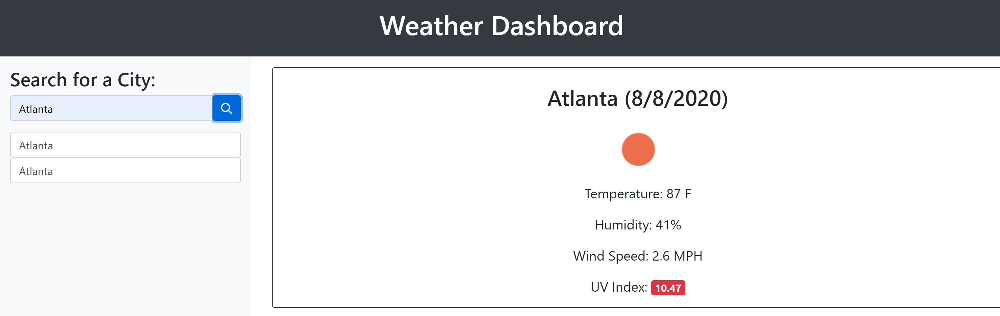

# WeatherDashboard

This weather dashboard application utilizes the OpenWeather API to retrieve weather data for any city searched by the user. The user can input any city to search and the weather conditions in that city will be displayed to the user.

The current conditions displayed include Temperature, Humidity, Wind-Speed, and UV-index. The UV-index is displayedd to the user using red, yellow, or green to represent wether the conditions are severe, moderate, or favorable  A Five Day forecast is given so the user can see the weather conditions currently as well as in the future for the city searched. The 5-day forecast displays the date, an icon representation of the weather conditions, the temperature, and the humidity.

Local storage is utilized to save past cities searched by the user. When the user opens the weather dashboard, the user is presented with the last searched city forecast and current weather conditions.

## Deployed Application
https://erikabeasley.github.io/WeatherDashboard/

